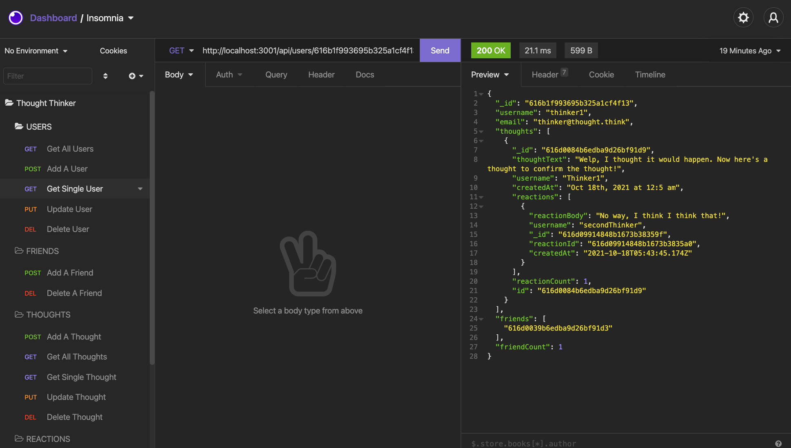

# Thought-Thinker-MongoDB-API

## Description
An API using MongoDB for a social networking application called Thought Thinker, where users can post their thoughts, react to others thoughts, and engage with other thinkers. In creating this application, the following technologies were used:

- Node.js
- Express
- MongoDB/Mongoose

## Table of Contents
* [Usage](#usage)
* [Installation](#installation)
* [Credits](#credits)
* [License](#license)
* [Contributing](#contributing)
* [Tests](#tests)
* [Questions](#questions)

## Installation

With no deployed front end, installing on your local machine is a must. Here's how to install:

    * In your command line, navigate to the desired location for this repo directory.
    * Use the command 'git clone' in your command line with the link of this repo to copy into your local machine.
    * Navigate into the newly cloned directory in your command line.
    * Run 'npm install' or 'npm i' in your command line while still in the root folder of this application to install dependencies required (express, mongoose)

## Usage
This application is a MongoDB NoSQL database and does not have a deployed front end to interact with this API. Here's what you can do if you would like to use this on your local machine or even connect it to a front end you may have:

    * Install using the installation instructions above.
    * Use an API endpoint testing application like Insomnia or Postman to interact with the endpoints in this database and perform CRUD operations on the data.
    * For the exact endpoint syntax, you can reference them in 2 places in the code:
        * In the "controllers" folder, see the comment above each CRUD operation in each controllers file for what the operation does and the endpoint.
        * In the routes/api folder, thought-routes and user-routes files also contain comments above each route for descriptions and enpoint details.
    * For Further details on the routes, view the walkthrough videos below

### Screenshots

[Click Here for Pt 1 walkthrough video](https://drive.google.com/file/d/1sPo4_zLT6SppymWJKfDcYUQPimOwWPHD/view?usp=sharing)

[Click Here for Pt 2 walkthrough video](https://drive.google.com/file/d/1sNABHHGV-v2sYUWXrRmA9JxxUwm1PGCn/view?usp=sharing)

## Credits
The user guidelines and learning concepts for this project were given by Trilogy Education as a part of the University of Kansas Full Stack Web Developer Bootcamp. © 2021 Trilogy Education Services, LLC, a 2U, Inc. brand. Date Formatting function in the utils folder provided by Triology Edication. Remaining code original to Brian Wilde.

## License

### MIT LICENSE

Permission is hereby granted, free of charge, to any person obtaining a copy
of this software and associated documentation files (the "Software"), to deal
in the Software without restriction, including without limitation the rights
to use, copy, modify, merge, publish, distribute, sublicense, and/or sell
copies of the Software, and to permit persons to whom the Software is
furnished to do so, subject to the following conditions:

The above copyright notice and this permission notice shall be included in all
copies or substantial portions of the Software.

THE SOFTWARE IS PROVIDED "AS IS", WITHOUT WARRANTY OF ANY KIND, EXPRESS OR
IMPLIED, INCLUDING BUT NOT LIMITED TO THE WARRANTIES OF MERCHANTABILITY,
FITNESS FOR A PARTICULAR PURPOSE AND NONINFRINGEMENT. IN NO EVENT SHALL THE
AUTHORS OR COPYRIGHT HOLDERS BE LIABLE FOR ANY CLAIM, DAMAGES OR OTHER
LIABILITY, WHETHER IN AN ACTION OF CONTRACT, TORT OR OTHERWISE, ARISING FROM,
OUT OF OR IN CONNECTION WITH THE SOFTWARE OR THE USE OR OTHER DEALINGS IN THE
SOFTWARE.

## Contributing
No contributing guidelines currently

## Tests
No tests at this time

## Questions
You can find my GitHub profile at https://github.com/bgswilde
For any further questions, reach out to me via email at bgswilde@gmail.com.
